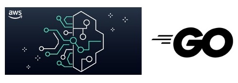

# AWS Go SDK examples for Amazon Bedrock

[Amazon Bedrock](https://docs.aws.amazon.com/bedrock/latest/userguide/what-is-service.html) is a fully managed service that makes base models from Amazon and third-party model providers accessible through an API.